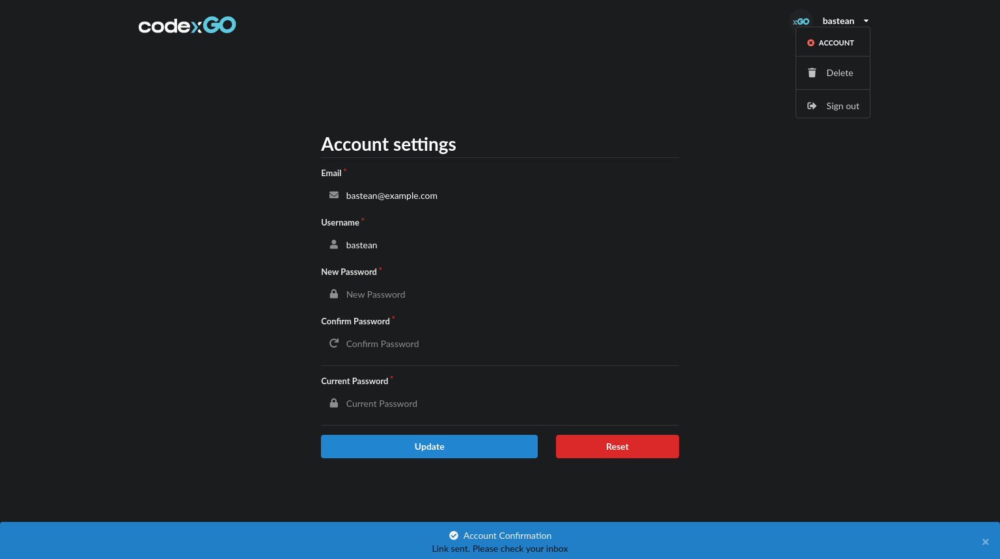

<h1 align="center">

<!-- [](https://github.com/bastean) -->

[](https://github.com/bastean/codexgo)

</h1>

<div align="center">

> Example CRUD project applying Hexagonal Architecture, Domain-Driven Design (DDD), Event-Driven Architecture (EDA), Command Query Responsibility Segregation (CQRS), Behavior-Driven Development (BDD), Continuous Integration (CI), and more... in Go

</div>

<br />

<div align="center">

[](LICENSE)
[](https://goreportcard.com/report/github.com/bastean/codexgo)
[](https://github.com/commitizen/cz-cli)
[](https://github.com/release-it/release-it)

</div>

<div align="center">

[](https://github.com/bastean/codexgo/actions/workflows/upgrade.yml)
[](https://github.com/bastean/codexgo/actions/workflows/ci.yml)
[](https://github.com/bastean/codexgo/actions/workflows/release.yml)

</div>

<div align="center">

[](https://pkg.go.dev/github.com/bastean/codexgo)
[](https://github.com/bastean/codexgo/releases)

</div>

## Features

- Project Layout

  - Based on [Standard Go Project Layout](https://github.com/golang-standards/project-layout)

- Message Broker

  - Routing Key (based on [AsyncAPI Topic Definition](https://github.com/fmvilas/topic-definition))

- Devcontainer

  - Features
  - Extensions & Settings

- Docker

  - Dockerfile
    - Multistage
  - Compose
    - Setup by ENV

- GitHub

  - Actions & Workflows
    - Setup Languages and Dependencies
    - Secrets Scanning, Linting & Test Checks
    - Upgrade Dependencies
    - Automate Release
  - Issue Templates (Defaults)

- Git

  - Hooks
    - Pre-Commit
      - Secrets Scanning & Formatting
    - Commit-Msg
      - Check [Conventional Commits](https://www.conventionalcommits.org) rules

- Releases

  - Automatically
    - Hooks
      - Linting & Test Checks
    - Bump Version (based on [Conventional Commits](https://www.conventionalcommits.org) & [SemVer](https://semver.org/))
    - CHANGELOG
    - Commit & Tag
    - GitHub Release

## First Steps

### Clone

#### HTTPS

```bash
git clone https://github.com/bastean/codexgo.git && cd codexgo
```

#### SSH

```bash
git clone git@github.com:bastean/codexgo.git && cd codexgo
```

### Initialize

#### Dev Container (recommended)

1. Install required

   - [Docker](https://docs.docker.com/get-docker)

     - [Dev Containers](https://marketplace.visualstudio.com/items?itemName=ms-vscode-remote.remote-containers)

2. Start VS Code

   ```bash
   code .
   ```

3. Open Command Palette

   - Ctrl+Shift+P

4. Run

   ```txt
   Dev Containers: Reopen in Container
   ```

#### Locally

1. Install required

   - [Go](https://go.dev/doc/install)
   - [Node](https://nodejs.org/en/download)
   - [Make](https://www.gnu.org/software/make)
   - [Docker](https://docs.docker.com/get-docker)

2. Run

   ```bash
   make init
   ```

#### ZIP

1. [Install required](#locally)

2. Run

   ```bash
   make from-zero
   ```

### Repository

#### Settings

- Actions

  - General

    - Workflow permissions

      - [x] Read and write permissions

- Secrets and variables

  - Actions

    - New repository secret

      - BOT_GPG_PRIVATE_KEY

        ```bash
        gpg --armor --export-secret-key [Pub_Key_ID (*-BOT)]
        ```

      - BOT_GPG_PASSPHRASE

### Run

#### Development

```bash
make compose-dev
```

#### Test

```bash
make compose-test
```

#### Production

```bash
make compose-prod
```

## Screenshots

<div align="center">





</div>

## Tech Stack

#### Base

- [Go](https://go.dev)
- [templ](https://templ.guide)
  - [htmx](https://htmx.org)
  - [Alpine.js](https://alpinejs.dev)
  - [Tailwind CSS](https://tailwindcss.com)
    - [daisyUI](https://daisyui.com)
- [MongoDB](https://www.mongodb.com)
- [RabbitMQ](https://www.rabbitmq.com)

#### Please see

- [go.mod](go.mod)
- [package.json](package.json)

## Contributing

- Contributions and Feedback are always welcome!

## License

- [MIT](LICENSE)
